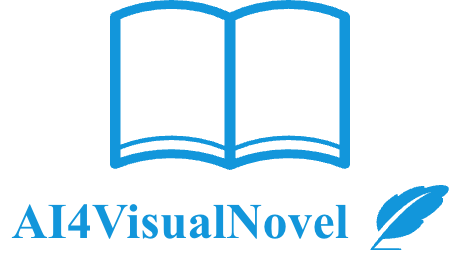
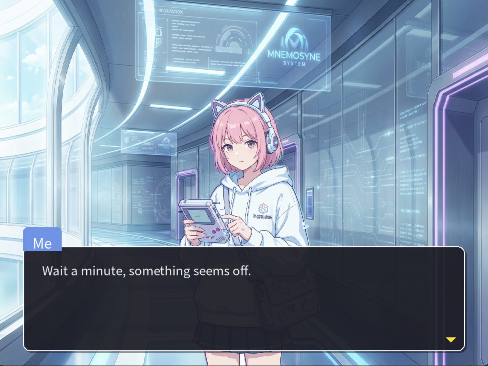
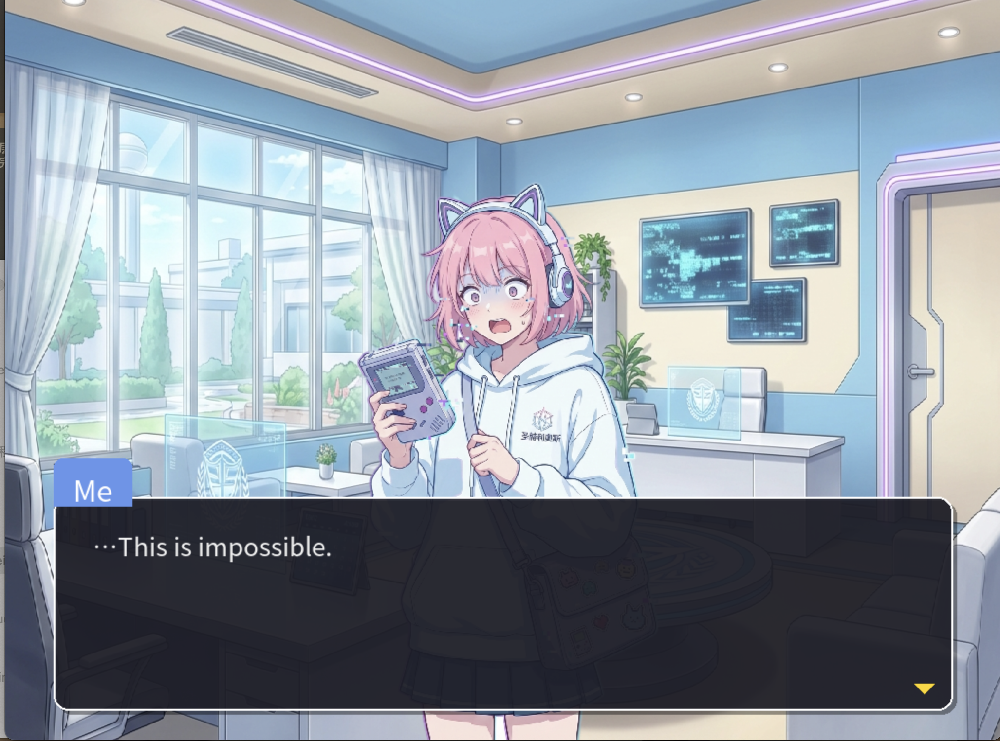
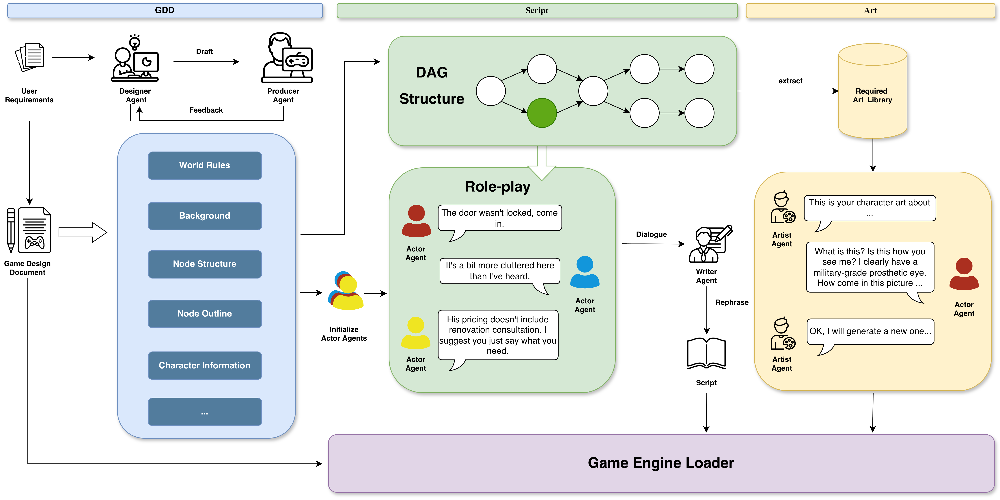

<p align="center">
    
</p>
<h3 align="center">
<b>AI4VisualNovel: A Role-Play Driven Multi-Agent Framework for
Topological Branching Narrative Generation and Visual Synthesis in Visual
Novel</b>
</h3>

`AI4VisualNovel` is an end-to-end framework specifically designed for **creating high-quality, multi-branch visual novels via a role-play driven multi-agent system**.
You only need to input your requirement, and the framework will generate the final game.

Unlike prior approaches that focus on linear narrative generation or struggle with cross-modal consistency, `AI4VisualNovel` proposes a **Topological Sort-based DAG (Directed Acyclic Graph) mechanism** , which allows for **causally consistent** non-linear storytelling and complex plot branching management. This design makes `AI4VisualNovel` **highly robust for generating long-form, immersive interactive narratives** where player choices genuinely impact the story direction.

`AI4VisualNovel` introduces a **novel "Actor Agent" paradigm** that participates in both dialogue generation and visual auditing. By simulating a professional studio pipeline (Producer, Writer, Actor, Artist) , it enables the generation of **persona-aligned character sprites** and authentic dialogue, ensuring that visual assets strictly adhere to character settings rather than generic descriptions. The framework directly outputs **playable game**, bridging the gap between LLM creativity and executable interactive media.


## 📺 Output Game Preview
<p align="center">
  
  
</p>


## 🏗️ Framework Overview
<p align="center">
    
</p>


## 🛠️ Installation

Follow these steps to set up your development environment:

1.  **Clone the Repository**:
    ```bash
    git clone https://github.com/your-repo/AI4VisualNovel.git
    cd AI4VisualNovel
    ```

2.  **Install Dependencies**:
    ```bash
    conda create -n AI4VisualNovel python=3.10
    conda activate AI4VisualNovel
    pip install -r requirements.txt
    ```

3.  **Configure Environment**:
    Fill in the parameters in the `.env` file as instructed before starting.

---

## 🎮 Visual Novel Generation & Execution

### 1. Story Generation
Start the multi-agent collaboration to generate world settings, characters, and scripts from scratch:
```bash
python main.py --mode create
```
*   **Outputs**: Generated files are all stored in `data` fold. 

### 2. Play the Game
Execute the built-in Pygame-based engine to experience the generated story:
```bash
python main.py --mode play
```
*Note: You can also utilize other game engines (e.g., Unity, Ren'Py) to load the formatted data in the `data` folder for a more polished user experience.*

### 3. Packaging & Distribution
If you want to distribute your Pygame masterpiece, build a standalone executable to share your game.

- **For Windows**:
  ```batch
  pyinstaller --onefile --windowed --name "AI4VisualNovel" --add-data "data;data" main.py
  ```
- **For macOS**:
  ```bash
  pyinstaller --onefile --windowed --name "AI4VisualNovel" --add-data "data:data" main.py
  ```
  

